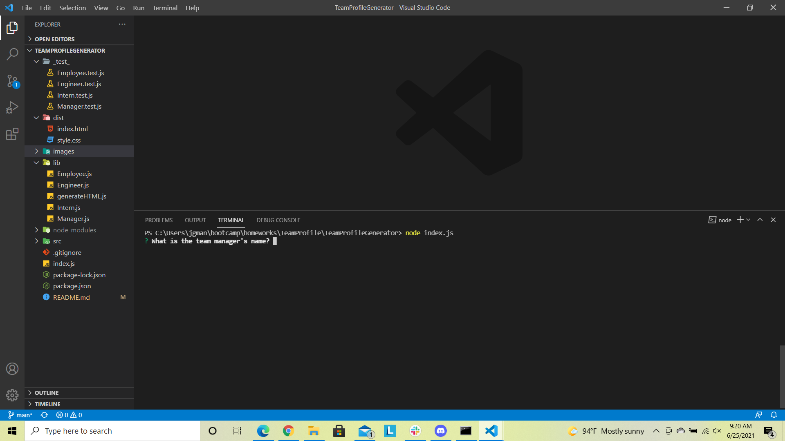
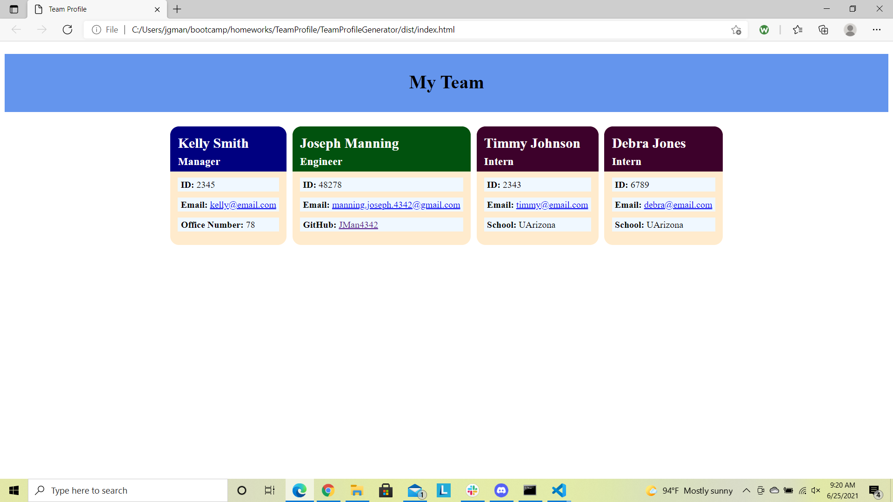
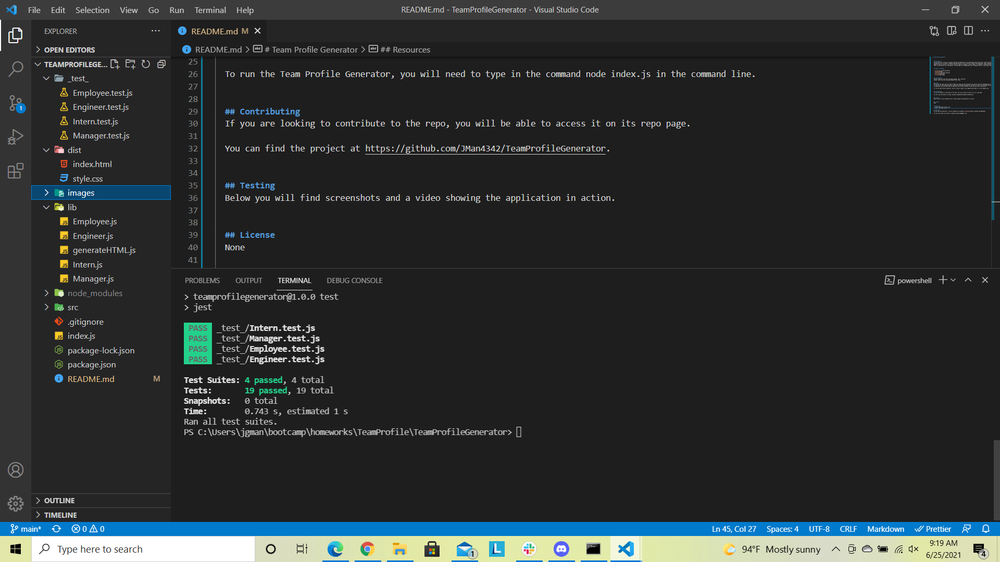

# Team Profile Generator
  
  

  ## Description
  This project will allow me to better organize the employees in my organization and access their contact information all in one location.  Through the use of a Node.js command-line application I will be able to capture each employee's name, employee number, and email address.  Based on their position I will also be able to capture a manager's office number, an engineer's GitHub profile, and an intern's school.  After collecting all this information, an HTML page will be generated with clickable links for their email and GitHub profiles.

  ## Table of Contents

  - [Installation](#installation)
  - [Usage](#usage)
  - [Contributing](#contributing)
  - [Testing](#testing)
  - [License](#license)

  ## Installation
  Install inquirier with the following command: npm i inquirier 
  Install jest with the following command: npm i jest
  

  ## Usage
  When using the repo, you will need to make sure that you have installed the inquirer and jest dependencies in the command line.  Inquirer is used to run the prompts that will capture the employee information, and Jest is used to run the application testing.  After an HTML file is generated, you will then need to open that file in your browser to have the best user interaction.

  To run the Team Profile Generator, you will need to type in the command node index.js in the command line.

  ## Contributing
  If you are looking to contribute to the repo, you will be able to access it on its repo page.

  You can find the project at https://github.com/JMan4342/TeamProfileGenerator.
  

  ## Testing
  Below you will find screenshots and a video showing the application in action.
  
  
  

  https://drive.google.com/file/d/1iGHf9zPXpDGjjSC-2fUrr4gS6zDT6PFi/view?usp=sharing
  

  ## License
  None
  

  ## Resources
  - https://developer.mozilla.org
  - https://www.npmjs.com/
  

  ## Questions
  If you have any questions, I can be reached on my GitHub at [JMan4342](https://github.com/JMan4342).

  You can also reach me by email at manning.joseph.4342@gmail.com.